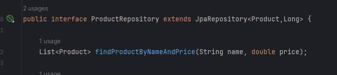
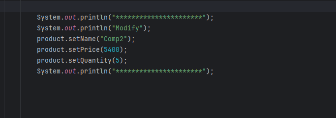

<h1>Compte rendu TP2 Partie1</h1>
<h4>1/ Creation d'une entite JPA Product</h4>

<h4>2/ Configuration de l'unité de persistance dans le ficher application.properties </h4>

<h4>3/ JPA Repository</h4>

<h4>4/ Test operations de gestion de patients</h4>
<h5>4.1/Ajouter des produits</h5>

Code:

Base de donnees

<h5>4.2/ Consulter tous les produits</h5>

Code:

Execution:

<h5>4.3/ Consulter Produit par Id</h5>

Code:

Execution:

<h5>4.4/ Recherche Produit: </h5>
<h6>a. Recherche Par Nom</h6>

Code Repo:

Code:

Execution:

<h6>b. Recherche Par Nom et Prix</h6>

Code Repo:

Code:

Execution:

<h6>c. Recherche Par Prix</h6>

Code Repo:

Code:

Execution:

<h5>4.5/Modifier des produits</h5>

Code:

Execution:

<h5>4.5/Suppression des produits</h5>

Code:

Execution:

<h4>5/ Migration vers MySql</h4>

